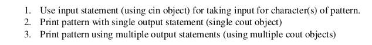
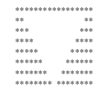
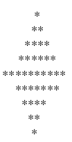
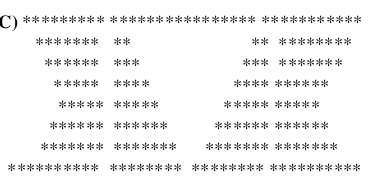
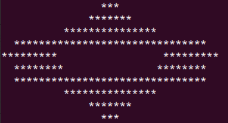

# Printing Patterns IOMANIP
Prints Certain patterns on console using "cout" and IOMANIP library

#### Pattern 1:

#### Pattern 2:

#### Pattern 3:

#### Pattern 4:

#### Pattern 5:

## Tools Used
C++/ iostream, iomanip
## How to run
Download the .cpp files and compile each of them in a c++ compiler to generate executables. Use the executables to run the programs.

